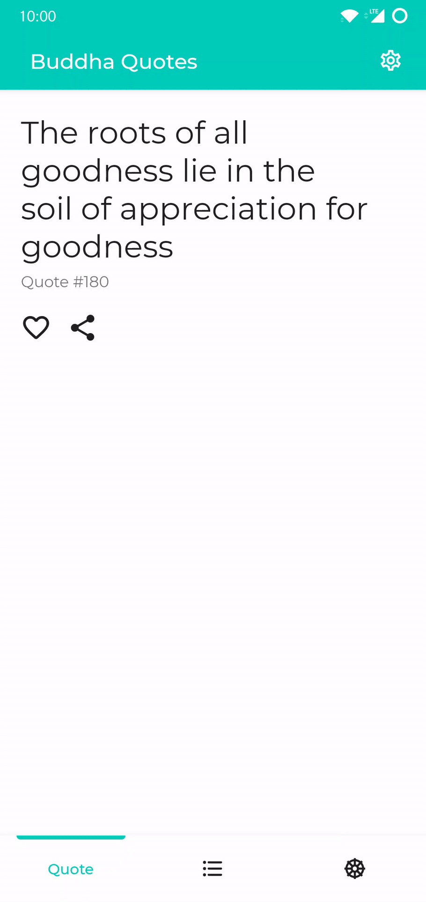

# Xplosion

Xplosion is a fork of [SmallBang](https://github.com/hanks-zyh/SmallBang) that has been converted to Kotlin and updated for the latest version of Android :smile:

Twitter like animation for any view :heartbeat:

 

## Usage

**Step 1.** Make sure `mavenCentral()` is added as a dependency in your root gradle file:
```groovy
allprojects {
    repositories {
        mavenCentral()
    }
}
```

**Step 2.** Add the dependency to your app's project gradle file:
```groovy
dependencies {
    implementation 'uk.bandev:xplosion:1.0.5'
}
```

**Step 3.** Add the view to your layout
```xml
<uk.bandev.xplosion.XplosionView
    android:id="@+id/xplosion"
    android:layout_width="wrap_content"
    android:layout_height="wrap_content">

    ...
    
</uk.bandev.xplosion.XplosionView>

```

## License

This library is licensed under the [Apache Software License, Version 2.0](http://www.apache.org/licenses/LICENSE-2.0).

See [`LICENSE`](LICENSE) for full of the license text.

    Licensed under the Apache License, Version 2.0 (the "License");
    you may not use this file except in compliance with the License.
    You may obtain a copy of the License at

        http://www.apache.org/licenses/LICENSE-2.0

    Unless required by applicable law or agreed to in writing, software
    distributed under the License is distributed on an "AS IS" BASIS,
    WITHOUT WARRANTIES OR CONDITIONS OF ANY KIND, either express or implied.
    See the License for the specific language governing permissions and
    limitations under the License.
